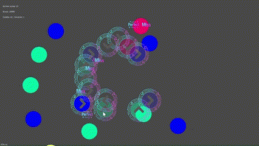
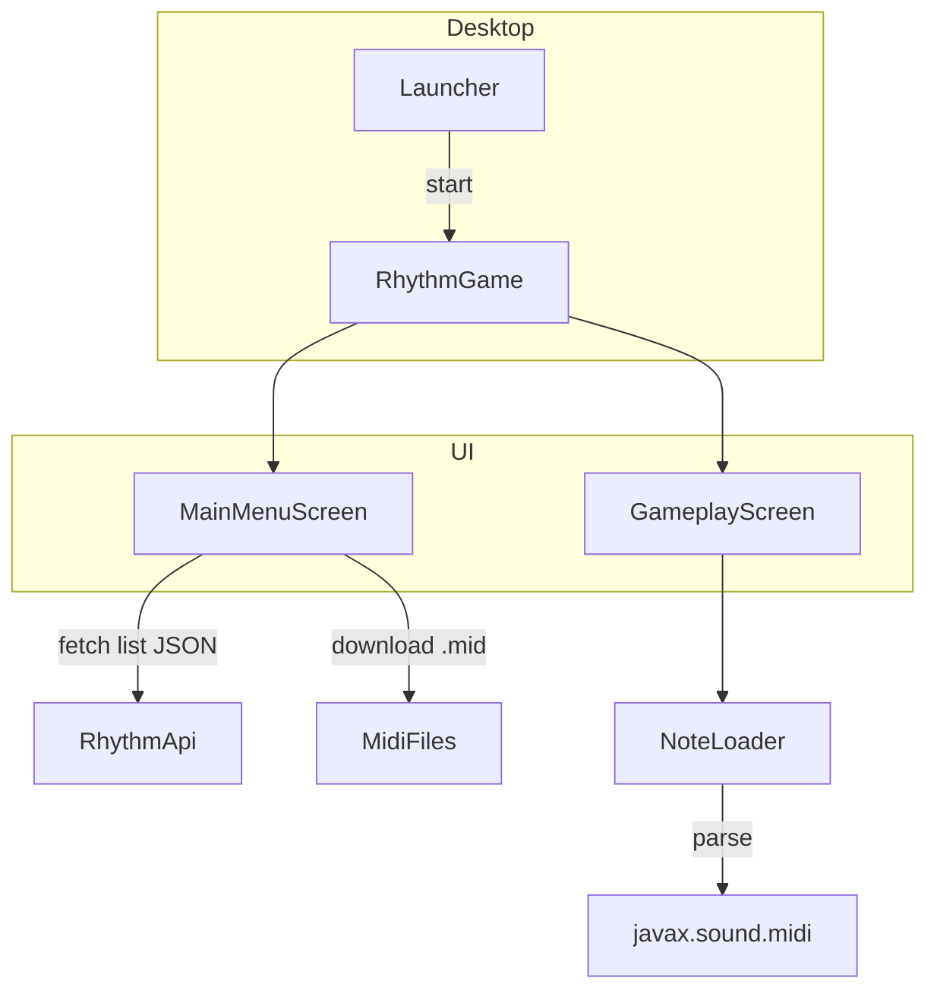

# ProjectISC – MegaMix 🎵✨


> Codé 100 % Scala + libGDX2D, for the culture.
>
> *« If DDR et osu! avaient un enfant polyglotte en Scala… »* – Gontran

---

## 📝 Table des matières

* [TL;DR](#tldr)
* [Démo](#demo)
* [Gameplay](#gameplay)
* [Architecture](#architecture)
* [Build & Run](#build--run)
* [Licence](#licence)

---

## TL;DR

|                       |                                          |
| --------------------- | ---------------------------------------- |
| 🎹 **4 lanes**        | **W A S D**                              |
| ⬇️ **Auto‑DL**        | Midi files depuis `midis.triceratops.ch` |
| 🏆 **Leaderboard**    | scoring serveur                          |


<details>
<summary>Screenshot & GIF demo</summary>



</details>

---

## Gameplay

| Touche | Lane       | Couleur  |
| ------ | ---------- | -------- |
| **W**  | 1 (haut)   | Vert 💚  |
| **A**  | 2 (gauche) | Jaune 💛 |
| **S**  | 3 (bas)    | Rouge ❤️ |
| **D**  | 0 (droite) | Bleu 💙  |


Le timing est roi :

| Feedback | Fenêtre | Score       |
| -------- | ------- | ----------- |
| Perfect  | ±50 ms  | 300×combo   |
| Good     | ±120 ms | 100×combo   |
| Miss     | >120 ms | Combo reset | 

---

## Architecture



* **gdx2d** : rendu 2D + portable window.
* **RhythmApi** : POST /register, /login, /score; GET /list, /leaderboard.
* **NoteLoader** : convertit ticks MIDI → positions circulaires « bullet‑hell ».
* **InstrumentExtractor** : Choix de l'instrument à l'utilisateur


#### Dépendances Maven (extrait `build.sbt`)

```scala
libraryDependencies ++= Seq(
  "org.json4s" %% "json4s-jackson" % "2.13",
  "org.json4s" %% "json4s-native"  % "2.12",
)
```

## Licence

Apache License 2.0

---

